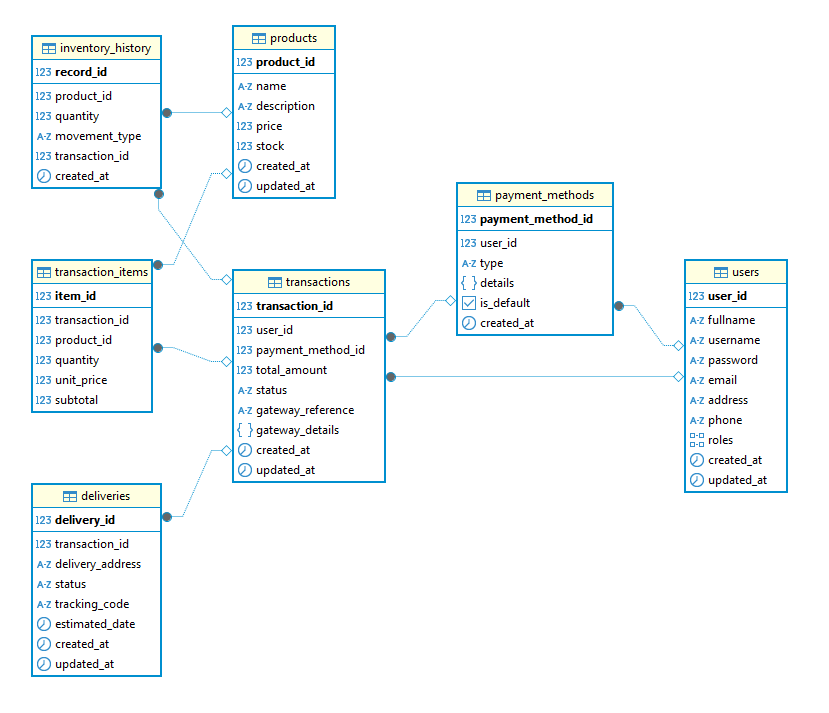

<p align="center">
  <a href="http://nestjs.com/" target="blank"></a>
</p>

<h1 align="center">🚨 API Simple payment</h1>

[circleci-image]: https://img.shields.io/circleci/build/github/nestjs/nest/master?token=abc123def456
[circleci-url]: https://circleci.com/gh/nestjs/nest

  <p align="center">API services for simple product payment.</p>
    <p align="center">
<a href="https://nestjs.com" target="_blank"></a>
<a href="https://www.typescriptlang.org" target="_blank"></a>
<a href="https://typeorm.io" target="_blank"></a>
<a href="https://www.postgresql.org" target="_blank"></a>
<a href="https://jestjs.io" target="_blank"></a>
<a href="https://swagger.io" target="_blank"></a>
<a href="https://prettier.io" target="_blank"></a>
<a href="https://eslint.org" target="_blank"></a>
</p>


## Description📍

Simple Payment API.

## Project setup ✅


```bash
# clone the project
$ git clone https://github.com/desobsesor/simple-payment-api.git

# install dependencies
$ npm install
```

## Compile and run the project 🛠

```bash
# development
$ npm run start

# watch mode
$ npm run start:dev

# production mode
$ npm run start:prod
```
## Running the app 🚀

This service is providing just a health endpoint which you can call to verify the service is working as expected:

```bash
curl --request GET \
  --url http://localhost:3000/v1/health
```

## Run tests 🚀

```bash
# unit tests
$ npm run test

# e2e tests
$ npm run test:e2e

# test coverage
$ npm run test:cov
```

## Deployment 🖥

When you're ready to deploy your NestJS application to production, there are some key steps you can take to ensure it runs as efficiently as possible. Check out the [deployment documentation](https://docs.nestjs.com/deployment) for more information.


## Database Schema - Simple Payment 📚

Below is our database schema diagram showing the relationships between tables:

<p align="center">
  
</p>

## SQL Scripts 💡

You can find the database initialization and setup scripts in the `scripts/sql` directory. These scripts contain:

- Table creation statements
- Initial data seeding
- Stored procedures and functions
- Database user and permission setup

To set up your database, execute the scripts in sequential order as numbered in the filenames.

## Built with 🛠️

_Tools and Technologies used_

- [NodeJS](https://nodejs.org/en/) - Server-side JavaScript environment,uses an asynchronous and event-driven model
- [NestJS](https://nestjs.com/) - Fast, unopinionated, minimalist web framework
- [Npm](https://www.npmjs.com/) - Dependency manager
- [Jest](https://jestjs.io/) - JavaScript Testing Framework
- [TypeORM](https://docs.nestjs.com/recipes/sql-typeorm) - SQL ORM for TypeScript and JavaScript
- [Swagger](https://swagger.io/) -Swagger is an open specification for defining APIs
- [PostgreSQL](https://https://www.postgresql.org/) - PostgreSQL is a powerful, open-source object-relational database system

## Support 🔍

Nest is an MIT-licensed open source project. It can grow thanks to the sponsors and support by the amazing backers. If you'd like to join them, please [read more here](https://docs.nestjs.com/support).

## Versioned 📌

[SemVer](http://semver.org/) is used for versioning. For all versions available.

## Author ✒️

_Built by_

- **Yovany Suárez Silva** - _Full Stack Software Engineer_ - [desobsesor](https://github.com/desobsesor)
- Website - [https://portfolio.cds.net.co](https://desobsesor.github.io/portfolio-web/)


## License 📄

This project is under the MIT License - see the file [LICENSE.md](LICENSE.md) for details
